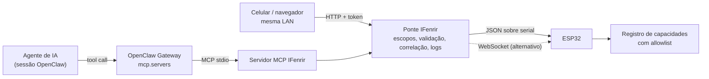

# IFenrir

[](https://github.com/SENAI4LIFE/IFenrir/actions/workflows/ci.yml)
[](#requisitos-da-plataforma)
[](#requisitos-da-plataforma)
[](firmware/)
[](bridge/)
[](#integração-com-o-openclaw)
[](#integração-com-o-openclaw)

IFenrir expõe capacidades IoT de um ESP32 a agentes de IA por meio de um contrato fechado de
capacidades, com validação de comandos, controle de permissões e rastreabilidade.

## Visão geral

O projeto trata de um problema concreto: como um ESP32 pode se apresentar como um conjunto de
capacidades a uma arquitetura de agentes, quais comandos podem ser expostos com segurança e
quais limitações surgem em memória, latência, autenticação, rastreabilidade e robustez.

Em vez de conectar um modelo de linguagem diretamente ao hardware, o IFenrir define um contrato
explícito de capacidades e o interpõe entre o agente e o dispositivo, de modo que toda
invocação seja declarada, validada, autorizada e registrada.

## Arquitetura de referência



| Componente | Responsabilidade | Diretório |
| --- | --- | --- |
| Contrato | Versão do protocolo, limites, códigos de erro e capacidades declaradas | [`protocolo/`](protocolo/) |
| Firmware | Executa capacidades, valida argumentos e aplica a allowlist local | [`firmware/`](firmware/) |
| Ponte | Autenticação, escopos, correlação, tempo limite e rastreabilidade | [`bridge/src/`](bridge/src/) |
| Servidor MCP | Publica as capacidades como ferramentas para o agente | [`bridge/src/mcp-server.js`](bridge/src/mcp-server.js) |
| Painel | Operação manual e demonstração em navegador ou celular | [`bridge/public/`](bridge/public/) |

Dois princípios sustentam a arquitetura:

- **Allowlist dupla e independente.** A ponte valida contra o contrato e os escopos; o firmware
  valida contra sua própria tabela estática. O dispositivo não executa capacidade que não
  declare, mesmo que a ponte seja comprometida.
- **Transporte substituível.** Serial e WebSocket compartilham o mesmo módulo de protocolo. O
  serial permite operar e validar sem depender de rede; o WebSocket cobre o cenário
  distribuído.

### Fronteira com o OpenClaw

A proposta original previa uma ponte conversando diretamente com um "OpenClaw Gateway
WebSocket". O OpenClaw integra ferramentas externas por **MCP** (`mcp.servers`, com transportes
stdio, SSE e streamable-http); seus *nodes* são dispositivos companheiros de áudio, câmera e
presença, não dispositivos IoT genéricos. A fronteira adotada é, portanto, um servidor MCP.

## Capacidades

O contrato canônico é [`protocolo/ifenrir-protocolo.json`](protocolo/ifenrir-protocolo.json),
carregado pela ponte em tempo de execução e espelhado pela tabela estática do firmware.

| Capacidade | Tipo | Escopo |
| --- | --- | --- |
| `listar_capacidades` | leitura | `leitura` |
| `obter_informacoes_dispositivo` | leitura | `leitura` |
| `obter_estado` | leitura | `leitura` |
| `obter_tempo_atividade` | leitura | `leitura` |
| `obter_memoria_livre` | leitura | `leitura` |
| `obter_memoria_minima` | leitura | `leitura` |
| `obter_motivo_reinicio` | leitura | `leitura` |
| `obter_estado_wifi` | leitura | `leitura` |
| `obter_rssi_wifi` | leitura | `leitura` |
| `ecoar` | leitura | `leitura` |
| `definir_rotulo` | escrita | `escrita` |
| `definir_led` | escrita | `escrita`, além de habilitação em `menuconfig` |

Capacidades de escrita que acionam hardware permanecem declaradas e não permitidas até que um
GPIO seguro seja confirmado para a placa em uso. O contrato não prevê shell, GPIO arbitrário,
acesso a memória ou a arquivos, e um teste garante que nenhuma capacidade com essa natureza
seja introduzida.

### Adicionando uma capacidade

1. Declare a capacidade em `protocolo/ifenrir-protocolo.json`, com tipo, resumo e argumentos.
2. Implemente o executor em `firmware/components/ifenrir_core/ifenrir_capacidades.c` e
   registre-o na tabela `s_registro`, definindo `permitida` conforme a política desejada.
3. Se houver argumentos, adicione o esquema correspondente em `bridge/src/mcp-server.js`.
4. Cubra a capacidade nos testes: contrato e escopo em `bridge/test/`, comportamento no
   dispositivo em `firmware/test_app/main/`.

Capacidades de escrita devem ser condicionadas por `Kconfig` sempre que atuarem sobre hardware.

### Protocolo

```json
{"protocolo":"ifenrir/1","id":"<correlação>","capacidade":"ecoar","argumentos":{"texto":"ola"}}
{"protocolo":"ifenrir/1","id":"<correlação>","sucesso":true,"capacidade":"ecoar","resultado":{"texto":"ola"},"ms":2}
{"protocolo":"ifenrir/1","id":"<correlação>","sucesso":false,"erro":{"codigo":"ARGUMENTO_INVALIDO","mensagem":"..."},"ms":1}
```

Códigos de erro: `PROTOCOLO_INVALIDO`, `MENSAGEM_MALFORMADA`, `MENSAGEM_EXCEDE_LIMITE`,
`CAMPO_OBRIGATORIO_AUSENTE`, `CAPACIDADE_DESCONHECIDA`, `CAPACIDADE_NAO_PERMITIDA`,
`ARGUMENTO_INVALIDO`, `TEMPO_ESGOTADO`, `DISPOSITIVO_DESCONECTADO`, `NAO_AUTENTICADO`,
`NAO_AUTORIZADO`, `FALHA_INTERNA`.

Limites: requisição 1024 B, resposta 4096 B, `id` 64 caracteres, `ecoar` 128 caracteres,
rótulo 32 caracteres, tempo limite 5000 ms. No transporte serial cada mensagem ocupa uma linha
prefixada por `@IFENRIR@`, separando o protocolo dos logs do ESP-IDF na mesma UART.

## Requisitos da plataforma

O IFenrir tem uma linha de base própria, deliberadamente menor que a do ESP-Claw. Os requisitos
abaixo estão separados por camada para evitar tratar exigências de um perfil ou de uma placa
como mínimo universal.

| Componente | Requisito |
| --- | --- |
| IFenrir (firmware) | Alvo ESP32 suportado pelo ESP-IDF, com partição de aplicação de 1,5 MB (`Single factory app, large`). 4 MB de flash são suficientes e PSRAM não é necessária. Wi-Fi apenas quando o transporte WebSocket for usado |
| IFenrir (ESP-IDF) | v5.4 ou superior |
| IFenrir (ponte) | Node.js 22 ou superior; Linux, macOS ou Windows |
| Ponte USB-serial | CH340, CP210x, FTDI ou USB-Serial-JTAG, reconhecidas na detecção automática |
| OpenClaw | Opcional, necessário apenas para o fluxo com agente de IA |
| ESP-Claw (geral) | Conforme a documentação oficial, no mínimo **8 MB de flash e 8 MB de PSRAM**, nas famílias ESP32-S3, ESP32-P4, ESP32-C5 e ESP32-S31 |
| ESP-Claw (ESP-IDF) | v5.5.4, indicado pelo guia oficial de build a partir do código-fonte |
| ESP-Claw (placas) | Selecionadas pelo ESP Board Manager (`pip install esp-bmgr-assist`, `idf.py bmgr -c ./boards -b <placa>`); `idf.py set-target` não é necessário, pois o alvo vem da placa. Placas não listadas exigem arquivos de adaptação em `application/edge_agent/boards/` |
| Perfil `mcp_server_point` | Aplicação MCP de referência do ESP-Claw. Usa layout de 16 MB por padrão e disponibiliza uma variante de 8 MB; o requisito efetivo depende da placa selecionada |

O alvo padrão do IFenrir é `esp32`. Outros alvos da família exigem apenas `idf.py set-target`,
desde que a partição de aplicação comporte o binário. A detecção escolhe a porta serial
automaticamente somente quando há uma única interface plausível; havendo mais de uma,
`IFENRIR_SERIAL_PORT` é obrigatório.

### Relação com o ESP-Claw

O ESP-Claw expõe capacidades nativamente por MCP (`cap_mcp_server`, `cap_mcp_client`) e traz a
aplicação de referência `mcp_server_point`. Em uma placa que atenda aos requisitos acima, o
próprio dispositivo pode atuar como servidor MCP e parte da ponte do IFenrir torna-se
dispensável.

Alvos fora dessa faixa, como o ESP32 clássico, não executam o ESP-Claw. Nesses casos o IFenrir
obtém o mesmo modelo de exposição de capacidades por uma camada externa, mantendo o contrato,
a allowlist e a fronteira MCP.

## Configuração e execução

```bash
# ESP-IDF
git clone --depth 1 --shallow-submodules --recursive -b v5.5.5 \
  https://github.com/espressif/esp-idf.git ~/esp/esp-idf
cd ~/esp/esp-idf && ./install.sh esp32 && . ./export.sh

# Firmware
cd /caminho/para/IFenrir/firmware
idf.py set-target esp32
idf.py build
idf.py -p <porta> flash

# Ponte
cd ../bridge
npm install
node src/cli.js detect
npm start
```

No Windows use `.\install.ps1 esp32` e `. $HOME\esp\esp-idf\export.ps1`.

Credenciais de Wi-Fi e da ponte ficam em `menuconfig` (menu **IFenrir**) e em variáveis de
ambiente; `firmware/sdkconfig` é ignorado pelo Git. As variáveis disponíveis estão em
[`bridge/.env.example`](bridge/.env.example).

O painel responde em `http://<host>:8787/`, com `GET /api/saude`, `GET /api/capacidades` e
`POST /api/invocar`; os dois últimos exigem token. Para operar de um celular, use o endereço do
host na mesma rede.

### Integração com o OpenClaw

```bash
openclaw mcp add ifenrir --command node --arg src/cli.js --arg mcp \
  --cwd /caminho/para/IFenrir/bridge --env IFENRIR_SERIAL_PORT=<porta>
openclaw mcp probe ifenrir
```

`IFENRIR_MCP_SCOPES` controla o que o agente enxerga e vale `leitura` por padrão, de modo que
capacidades de escrita não são expostas sem decisão explícita. Para remover o registro, use
`openclaw mcp unset ifenrir`.

## Testes

| Suíte | Comando | Requer hardware |
| --- | --- | --- |
| Unidade, protocolo, integração e MCP | `npm test` | não |
| Interface e responsividade | `npm run test:interface` | não |
| Ambas | `npm run test:tudo` | não |
| Capacidades no dispositivo | `npm run validar-hardware` | sim |
| Caminho MCP sobre o dispositivo | `npm run validar-mcp` | sim |
| Unity no dispositivo | `cd firmware/test_app && idf.py build && idf.py -p <porta> flash` | sim |

Os comandos da ponte são executados em [`bridge/`](bridge/). A aplicação Unity substitui
temporariamente o firmware principal; regrave-o com `idf.py -p <porta> flash` a partir de
[`firmware/`](firmware/) ao terminar. A saída do Unity é lida com
`node scripts/capture-serial.mjs <porta> 14000`.

A suíte de interface cobre Chromium, Firefox e WebKit em resoluções de 320 a 1920 px, usando um
dublê determinístico do dispositivo, e verifica execução de capacidades, erros estruturados,
rejeição por escopo, estados de indisponibilidade e ausência de transbordo horizontal.

O CI executa tudo que não depende de hardware: build do firmware e da aplicação de testes,
testes da ponte em Node 22 e 24 e a suíte de interface completa. Diagnósticos de falha da
interface ficam disponíveis como artefato da execução.

Evidências experimentais e cobertura por objetivo técnico estão em
[`docs/validacao.md`](docs/validacao.md).

## Segurança

- Allowlist fechada, aplicada na ponte e no firmware de forma independente.
- Tokens por papel com escopos `leitura` e `escrita`, comparados em tempo constante.
- O agente de IA recebe apenas escopo de leitura por padrão.
- Validação estrita de tipos, tamanhos e versão de protocolo, com limites de bytes em todas as
  camadas.
- Tempo limite por requisição, falha explícita das pendentes e reconexão com recuo progressivo.
- Os logs redigem campos com `token`, `senha`, `password`, `secret`, `apikey` ou
  `authorization`.
- Nenhum segredo versionado; `firmware/sdkconfig` e `.env` ignorados pelo Git.

Não há TLS entre cliente e ponte: o uso previsto é em rede local confiável.

## Estado do projeto

Protótipo experimental em evolução. Estão disponíveis o firmware com registro de capacidades e
allowlist, a ponte com autenticação por escopos e rastreabilidade, o servidor MCP para
integração com o OpenClaw, o painel de operação e as suítes automatizadas de software,
interface e hardware.

O fluxo em linguagem natural depende de um provedor de LLM configurado no OpenClaw, e o
transporte WebSocket depende de credenciais de rede fornecidas pelo operador.

## Solução de problemas

| Sintoma | Ação |
| --- | --- |
| ESP32 não detectado | Instale o driver da ponte USB-serial e use cabo de dados; confira com `node src/cli.js detect` |
| Mais de uma interface provável | Informe `IFENRIR_SERIAL_PORT`; a detecção não escolhe sozinha |
| Porta ocupada | Feche `idf.py monitor` e outras instâncias da ponte |
| Permissão negada no Linux | `sudo usermod -aG dialout $USER` e reabra a sessão |
| Falha ao gravar | Reduza com `-b 115200`, segure `BOOT` ao iniciar, troque a porta USB |
| Wi-Fi não conecta | Confira SSID e senha no `menuconfig` e use uma rede 2,4 GHz |
| Gateway do OpenClaw não inicia | `openclaw gateway --allow-unconfigured` ou `openclaw onboard --mode local` |
| `NAO_AUTORIZADO` | Escopo insuficiente para a capacidade |
| `CAPACIDADE_NAO_PERMITIDA` | Bloqueio da allowlist do firmware |
| `PROTOCOLO_INVALIDO` | Firmware e ponte em versões diferentes; regrave o firmware |

Recuperação sem apagar o NVS: `python -m esptool --port <porta> chip-id`, depois
`idf.py -p <porta> app-flash` e, se necessário, `idf.py -p <porta> flash`. `erase-flash` apaga a
identidade e o rótulo do dispositivo e não é necessário neste projeto.

## Referências

- [espressif/esp-claw](https://github.com/espressif/esp-claw)
- [ESP-IDF Programming Guide](https://docs.espressif.com/projects/esp-idf/)
- [openclaw/openclaw](https://github.com/openclaw/openclaw) e [Conectar servidores MCP](https://github.com/openclaw/openclaw/blob/main/docs/tools/mcp.md)
- [Model Context Protocol](https://modelcontextprotocol.io)
- [RFC 6455](https://datatracker.ietf.org/doc/html/rfc6455) e [RFC 8446](https://datatracker.ietf.org/doc/html/rfc8446)
